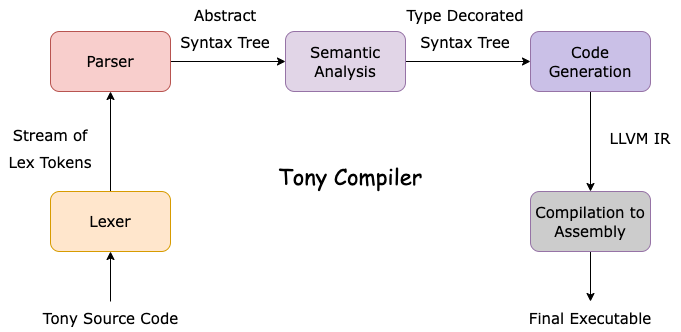

[](https://app.travis-ci.com/mstou/ntua-compilers)

# Tony

A Compiler for the Tony Language written in Python.

_This is part of the semester assignment for the [Compilers](https://courses.softlab.ntua.gr/compilers/2020a/) course at ECE NTUA._

Tony is a Turing Complete toy-language with Pascal-like syntax.
You can check the [language reference](tony2020.pdf) (in Greek) for more details, or explore some example [implementations](tests/tony-programs/correct-programs)
(e.g.
[QuickSort](tests/tony-programs/correct-programs/quicksort.tony),
[DFS](tests/tony-programs/correct-programs/dfs.tony), [BubbleSort](tests/tony-programs/correct-programs/bubblesort.tony),
[2D Array Addition](tests/tony-programs/correct-programs/array_addition_2d.tony),
[Primality Testing](tests/tony-programs/correct-programs/primes.tony)
[Hanoi Towers](tests/tony-programs/correct-programs/hanoi.tony),
[Reversing a String](tests/tony-programs/correct-programs/string_reverse.tony),
[Palindrome Testing](tests/tony-programs/correct-programs/is_palindrome.tony) etc.)


## Contents

* [Installation](#installation)
* [Usage](#usage)
  * [Example](#example)
* [Software Architecture](#software-architecture)
* [Tests](#tests)

## Installation

To use the Tony Compiler you should have `llvm-11`, `gcc`
and `Python 3.8` or greater installed. You can install the
dependecies and the python packages used with the following
command:

```
$ make install
```

_(`$` is the shell prompt)_

## Usage

The final executable is `tonyc.py`, which you can use to compile
your code.

For its default usage, you simply have to provide the name
of a Tony Program as the only argument (e.g. `hello.tony`)
and the compiler creates 3 files:
* one containing the LLVM IR code
(e.g. `hello.ll`)
* one containing the compiled Assembly for your machine (e.g.
`hello.s`)
* the final executable (e.g. `hello.out`)

Apart from its default usage, the following arguments are
also provided to the users

* `-f`: The compiler reads a Tony Program from `stdin` and prints the compiled Assembly to `stdout`.

* `-i`: The compiler reads a Tony Program from `stdin` and prints the LLVM IR Code to `stdout`.

* `-O2`, `-O3`: These are optimization flags for the final code.
The available optimizations are those provided by the [LLVM
PassManagerBuilder](https://llvm.org/doxygen/classllvm_1_1PassManagerBuilder.html) and are mentioned in detail in this [post](https://stackoverflow.com/a/15548189/7438512).

* `--ast`: The compiler reads a Tony Program from `stdin` and prints the Abstract Syntax Tree to `stdout`.

* `-o <name>`: The compiler names the target executable as the parameter given and does not output the LLVM IR or the final Assembly.

* `--commands`: The commands ran by the compiler for the
compilation of LLVM and the creation of the final executable
are printed to `stdout`

### Example

Suppose we want to compile the following program (`example.tony`):

```
def main():
	int x
	x := 7 * 10 + 10 / 3
	puti(x)
	puts("\n")
end
```

To use the default behaviour of our compiler we would run the
following command:

```
$ ./tonyc.py example.tony
$ ls
example.ll   example.s    example.out
$ ./example.out
73
```

To specify a custom executable name we would use the `-o`
arguement:

```
$ ./tonyc.py example.tony -o a.out
$ ls
a.out
$ ./a.out
73
```

To print the Abstract Syntax Tree in `stdout` we would use the `--ast` argument:
```
$ ./tonyc.py --ast < example.tony

Program:
|-- Function Definition
  |-- Function Header
    |-- Name: main
    |-- Return Type: void
    |-- Variables:NONE
  |-- Variable definitions:
    |-- int x
  |-- Statements:
    |-- Assignment
      |-- Name: x
      |-- Expression
        |-- +
          |-- *
            |-- 7
            |-- 10
          |-- /
            |-- 10
            |-- 3
    |-- Function Call
      |-- Function Name: puti
      |-- Parameters
        |-- Parameter 1
          |-- x
    |-- Function Call
      |-- Function Name: puts
      |-- Parameters
        |-- Parameter 1
          |-- \n
```
To print the LLVM IR Code in `stdout` we would use `-i`:

```llvm
$ ./tonyc.py -i < example.tony

@str_literal_1 = global [2 x i8] c"\0A\00"

declare void @_puti(i32) local_unnamed_addr

declare void @_puts(i8*) local_unnamed_addr

define void @main() local_unnamed_addr {
main_entry:
  call void @_puti(i32 73)
  call void @_puts(i8* getelementptr inbounds ([2 x i8], [2 x i8]* @str_literal_1, i64 0, i64 0))
  ret void
}
```

To print the Assembly code for our machine in `stdout` we would use `-f`:

```assembly
$ ./tonyc.py -f < example.tony

.text
.file	"<string>"
.globl	main                            # -- Begin function main
.p2align	4, 0x90
.type	main,@function
main:                                   # @main
.cfi_startproc
# %bb.0:                                # %main_entry
pushq	%rax
.cfi_def_cfa_offset 16
movl	$73, %edi
callq	_puti@PLT
movq	str_literal_1@GOTPCREL(%rip), %rdi
callq	_puts@PLT
popq	%rax
.cfi_def_cfa_offset 8
retq
.Lfunc_end0:
.size	main, .Lfunc_end0-main
.cfi_endproc
                                      # -- End function
.type	str_literal_1,@object           # @str_literal_1
.data
.globl	str_literal_1
str_literal_1:
.asciz	"\n"
.size	str_literal_1, 2

.section	".note.GNU-stack","",@progbits

```

## Software Architecture



## Tests

To run all the tests simply run
```
make test
```
If you want to run only a specific category of tests you can use the category's pytest marker (defined below) and run
```
pytest -m marker
```

We have implemented the following tests for our compiler

* __Lexer Tests__: (`tests/test_lexer.py`) (pytest marker: `lexer`)
  * Unit tests for the lexer where we supply hand-written
    inputs and test the output against the expected `LexTokens`

* __Parser Tests__: (`tests/test_parser.py`) (pytest marker: `parser`)
  * These are integration tests for the lexer and the parser. We assert that we can parse all the programs under `tests/tony-programs/correct-programs`

* __Semantics Unit Tests__: (`tests/test_semantics_unit.py`) (pytest marker: `semantics`)
  * These are unit tests for the semantic analysis. We construct the ASTs of some valid or invalid expressions by hand and assert that we get the expected behaviour.

* __Semantics Integration Tests__: (`tests/test_semantics_integration.py`) (pytest marker: `semantics`)
  * These are lexer-parser-semantics integration test. We parse and perform semantic analysis on various Tony programs.
  * We assert that all programs in `tests/tony-programs/correct-programs` are parsable and semantically correct
  * We created some extra Tony programs (`tests/tony-programs/incorrect-semantics`) that have no syntax errors but are semantically incorrect. We assert that all of those pass from
  the parser but are found incorrect during the semantic analysis.

* __End to End Tests__: (`tests/test_end_to_end.py`) (pytest marker: `end2end`)
  * These are end to end tests for the complete pipeline.
    We compile each program in (`tests/tony-programs/incorrect-semantics`) and run it against some pairs of expected inputs and outputs (`tests/test-inputs`)
